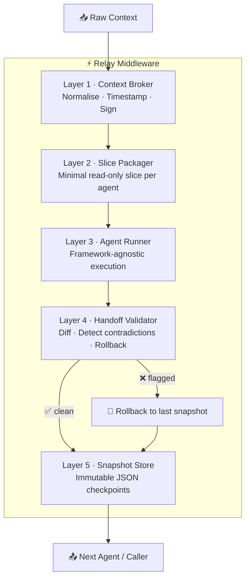
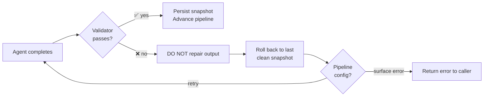
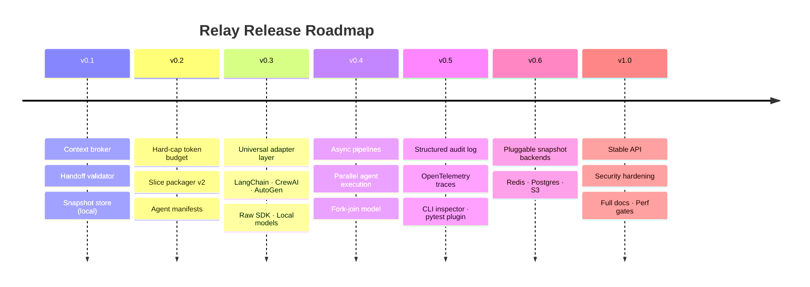
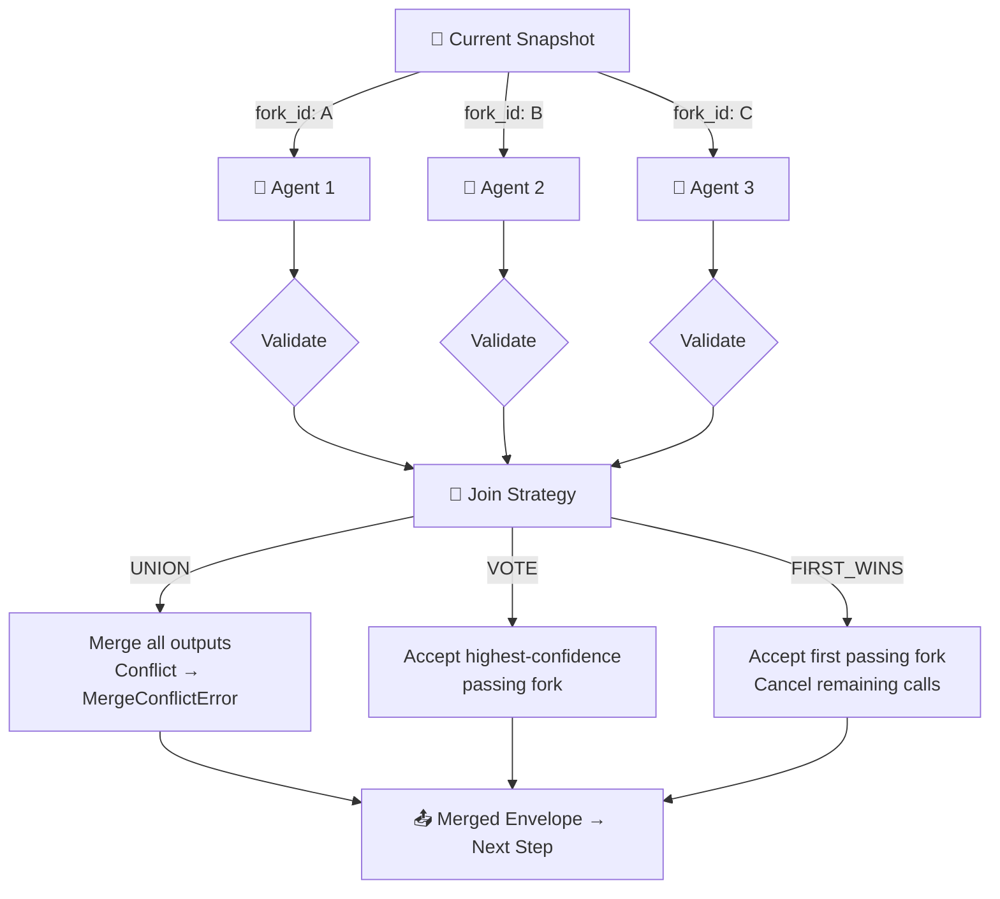

# ⚡ Relay
### Agent-agent context passing, done right
`v0.1 — May 2026` · `open source` · `Python`

---

## 1. What is Relay?

Relay is a lightweight, open-source middleware library for Python that solves **one specific problem**: making context pass reliably between AI agents in a multi-agent pipeline.

Every multi-agent system today is held together with brittle custom scripts. Developers manually serialize conversation history, dump it into the next agent's prompt, and pray nothing breaks. When it does break, there's no audit trail, no rollback, and no way to know which agent introduced corrupted data.

Relay replaces that guesswork with a thin, opinionated layer that handles context packaging, validation, snapshotting, and rollback — automatically.

### The problem in one sentence

> One hallucinating agent silently corrupts the shared context, and every downstream agent inherits the damage.

The root cause: existing orchestration tools treat the context window as a mutable blob with no version control. **Relay treats it like a ledger** — append-only, signed at every step, and reversible.

### What Relay is NOT

| ❌ Not this | ✅ Use this instead |
|---|---|
| An agent framework | Your own prompts, personas, and tool calls |
| An LLM router | LiteLLM, LangChain, direct SDK |
| A full orchestration platform | Relay is the connective tissue, not the conductor |
| Opinionated about agent design | Bring your own agents |

---

## 2. Architecture

Relay has **five independently testable and replaceable layers**.



| # | Layer | Responsibility |
|---|---|---|
| 1 | **Context Broker** | Normalises, timestamps, and cryptographically signs the context envelope before any agent touches it |
| 2 | **Slice Packager** | Cuts a minimal, read-only slice of context per agent — agents never see the full history |
| 3 | **Agent Runner** | Executes the agent call; framework-agnostic, works with any LLM or local model |
| 4 | **Handoff Validator** | Runs between every handoff — detects contradictions, diffs changes, triggers rollback if needed |
| 5 | **Snapshot Store** | Persists every clean checkpoint as immutable JSON; the rollback target |

---

## 3. The Context Envelope

Every time context moves between agents, it's wrapped in a **signed, immutable envelope**.

```json
{
  "relay_version": "0.1.0",
  "pipeline_id": "uuid-v4",
  "step": 2,
  "timestamp": "2026-05-04T10:22:00Z",
  "token_budget_used": 1840,
  "token_budget_total": 8000,
  "payload": { "...agent output..." },
  "signature": "sha256:abc123..."
}
```

The signature covers the full payload. If any downstream process tampers with the envelope, validation fails immediately and the pipeline rolls back to the last clean snapshot.

---

## 4. Rollback Behaviour



> **Core design decision:** Repair logic is speculative and usually makes things worse. Rollback is deterministic.

---

## 5. Roadmap to v1.0



---

## 6. v0.2 — Token Budget Enforcement + Slice Packager v2

**Theme:** Make the core loop airtight before expanding surface area.

### Token Budget: Hard Cap

```
Before agent call → calculate projected token cost of slice
                         ↓
          token_budget_used + projected > token_budget_total?
                    ↙ yes              ↘ no
    BudgetExceededError            Agent call proceeds
    (step index, limit, usage)
```

No soft warnings. No overflow. The cap is a hard wall.

> Framework builders can wrap `BudgetExceededError` with their own retry or escalation logic.

**Implementation details:**

| Setting | Behaviour |
|---|---|
| Token counter | `tiktoken` (`cl100k_base`) by default; pluggable via `TokenCounter` interface |
| Budget scope | Set per `pipeline_id` at init; individual steps cannot override |
| Budget tracking | `token_budget_used` updated **after** successful validator pass — failed steps don't consume budget |

### Slice Packager v2 — Strategies

| Strategy | How it works | When to use |
|---|---|---|
| **Recency** *(default)* | Last N messages by token count | General purpose |
| **Relevance** | Cosine similarity vs. current step's task description | Semantically rich pipelines |
| **Structural** | Respects `[FACTS]`, `[DECISIONS]`, `[SCRATCHPAD]` section markers | Structured, auditable pipelines |

### Agent Manifest (new in v0.2)

```json
{
  "agent_id": "summariser",
  "reads": ["FACTS", "DECISIONS"],
  "writes": ["SUMMARY"],
  "max_tokens": 2000
}
```

An agent that writes to an undeclared section raises `HandoffValidationError`. First step toward **agents that are auditable by design**.

---

## 7. v0.3 — Universal Adapter Layer

**Theme:** No lock-in. Work with whatever the framework builder is already using.

### The One Interface

```python
class AgentRunner(Protocol):
    async def run(self, slice: ContextSlice, manifest: AgentManifest) -> AgentOutput:
        ...
```

That's the entire contract. The runner receives a slice (not the full context) and the manifest. It returns a structured `AgentOutput`. Everything else — prompt construction, retries, streaming — is the adapter's responsibility.

### Bundled Adapters

| Adapter | Wraps | Notes |
|---|---|---|
| **LangChainAdapter** | Any `Runnable` or `Chain` | Converts `ContextSlice` to message list; maps LangChain callbacks to Relay audit format |
| **CrewAIAdapter** | `CrewAI Agent` | Normalises tool-use output; disables CrewAI's internal memory (Relay owns state) |
| **AutoGenAdapter** | `AssistantAgent` / `UserProxyAgent` | Single-steps AutoGen's loop; captures delta only, not full history |
| **RawSDKAdapter** | OpenAI / Anthropic / Gemini | Accepts a `callable(messages) → str\|dict`; maximum control, zero framework overhead |
| **LocalModelAdapter** | Ollama / vLLM | Targets OpenAI-compatible REST; configurable `base_url` + model name |

### AgentOutput Schema

```json
{
  "text": "...",
  "structured": {},
  "tool_calls": [],
  "token_count": 412,
  "latency_ms": 1840,
  "adapter": "langchain"
}
```

The handoff validator runs on `AgentOutput`, not the raw adapter response — this is what makes the validator framework-agnostic.

---

## 8. v0.4 — Async Pipelines: Parallel Agent Execution

**Theme:** Multiple agents working on the same context simultaneously, without corrupting each other.

### Fork-Join Model



### Join Strategies

| Strategy | Behaviour | Best for |
|---|---|---|
| **UNION** | Merges all outputs; conflicts raise `MergeConflictError` + rollback | Complementary agents writing to distinct sections |
| **VOTE** | Accepts the fork with highest validator confidence score | Redundant agents with different prompts/models |
| **FIRST_WINS** | Accepts first passing fork; cancels the rest | Latency-sensitive pipelines with interchangeable agents |

### Failure Handling

| Fork fails under... | Result |
|---|---|
| `UNION` | Entire parallel step fails → rollback to pre-fork snapshot |
| `VOTE` | Failed fork discarded; step fails only if **all** forks fail |
| `FIRST_WINS` | Failed fork discarded; next completed fork wins |

### Envelope Fields for Parallel Steps

```json
{
  "fork_id": "uuid-v4",
  "join_strategy": "UNION",
  "fork_count": 3,
  "forks_succeeded": 3
}
```

---

## 9. v0.5 — Observability + Developer Tooling

**Theme:** If you can't see what Relay is doing, you can't debug your pipeline or trust it in production.

### Structured Audit Log

Every Relay event emits structured JSON at the `relay.audit` logger:

```json
{
  "event": "handoff_validator.failed",
  "pipeline_id": "uuid-v4",
  "step": 3,
  "fork_id": null,
  "reason": "contradiction_detected",
  "diff": { "...changed fields..." },
  "rolled_back_to_step": 2,
  "ts": "2026-05-04T10:22:01Z"
}
```

Wire it to any sink — stdout, Datadog, Grafana Loki. No proprietary sink is bundled.

### OpenTelemetry

Each pipeline run produces an OTEL trace. Each step → a span. Parallel forks → child spans.

```
pip install relay-context[otel]
```

OTEL export is opt-in. If the extra isn't installed, Relay skips trace emission silently.

### CLI Inspector

```bash
# List all snapshots for a pipeline
relay inspect --pipeline <pipeline_id>

# Diff two snapshots
relay diff --pipeline <pipeline_id> --from 2 --to 3

# Manually roll back
relay rollback --pipeline <pipeline_id> --to 2
```

Reads from the same snapshot store the library writes to. No server or daemon required.

### Pytest Plugin (`relay-pytest`)

| Fixture / Helper | Does |
|---|---|
| `relay_pipeline` | Spins up an isolated in-memory pipeline per test |
| `assert_clean_handoff(step)` | Asserts a step passed validation |
| `assert_rolled_back(step)` | Asserts a rollback was triggered at a step |
| `snapshot_at(step)` | Returns the snapshot at a step for custom assertions |

---

## 10. v0.6 — Pluggable Snapshot Store Backends

**Theme:** Local disk is fine for dev. Production needs options.

### The Interface

```python
class SnapshotStore(Protocol):
    def save(self, envelope: Envelope) -> None: ...
    def load(self, pipeline_id: str, step: int) -> Envelope: ...
    def list(self, pipeline_id: str) -> list[SnapshotMeta]: ...
    def delete(self, pipeline_id: str, step: int) -> None: ...
```

### Bundled Backends

| Backend | Install | Notes |
|---|---|---|
| **LocalFileStore** | *(default, ships in v0.1)* | JSON files in a configurable directory |
| **RedisStore** | `relay-context[redis]` | Uses `HSET`; configurable TTL |
| **PostgresStore** | `relay-context[postgres]` | `JSONB` in `relay_snapshots`; schema managed by Relay, no migrations needed |
| **S3Store** | `relay-context[s3]` | Gzipped JSON objects; configurable bucket and prefix |

---

## 11. v1.0 — Production Release

**Theme:** Stable API, hardened security, complete documentation, ecosystem-ready.

### API Stability Guarantee

From v1.0, the public API is stable. Breaking changes require a major version bump. The public API surface is defined explicitly in `relay/__init__.py` — anything not exported there is internal and may change without notice.

### Security Hardening

| Feature | Detail |
|---|---|
| **Key rotation** | Pipelines can rotate signing keys mid-run; old envelopes remain verifiable via key history log |
| **Replay attack prevention** | Monotonically increasing nonce per pipeline; envelopes with stale nonces are rejected |
| **Constant-time comparison** | Prevents timing attacks on signature validation |

### Performance Gates

These are **gates, not goals** — if Relay can't hit them, the release is blocked.

| Scenario | Max Relay overhead |
|---|---|
| 10-step sequential pipeline, 8K token budget | < 50ms per step (excl. LLM call) |
| 5-fork parallel pipeline merge + validate | < 100ms (excl. LLM call) |

### Explicitly Out of Scope for v1.0

- A UI or dashboard
- Prompt management or template rendering
- Agent memory beyond the snapshot store
- Built-in retry logic beyond rollback
- Any paid or hosted service

---

## Appendix A — Release Summary

| Version | Highlights |
|---|---|
| **v0.1** | Context broker · Handoff validator · Snapshot store (local file) |
| **v0.2** | Hard-cap token budget enforcement · Slice packager v2 · Agent manifests |
| **v0.3** | Universal adapter layer (LangChain, CrewAI, AutoGen, Raw SDK, Local) |
| **v0.4** | Async pipelines · Parallel agent execution · Fork-join model |
| **v0.5** | Structured audit log · OpenTelemetry · CLI inspector · pytest plugin |
| **v0.6** | Pluggable snapshot store backends (Redis, Postgres, S3) |
| **v1.0** | Stable API · Security hardening · Full docs · Performance gates |

---

## Appendix B — Design Principles

These apply to every version, every decision.

> **1. One job.**
> Relay moves context between agents safely. It does not do anything else.

> **2. Determinism over cleverness.**
> Rollback beats repair. Hard caps beat warnings. Explicit beats inferred.

> **3. Bring your own everything.**
> No LLM provider, embedding model, agent framework, or storage backend is required. Every dependency is optional or pluggable.

> **4. Testability is a feature.**
> Every layer is independently testable. The pytest plugin ships alongside the library, not as an afterthought.

> **5. Framework builders are the user.**
> The API surface is designed for people building abstractions *on top of* Relay, not for end users calling agents directly. This means the API is explicit, composable, and low-level enough to be useful.

---

*Relay — the connective tissue, not the orchestrator.*
